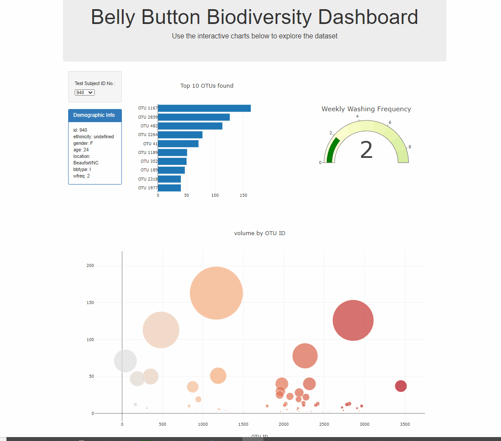

# plotly-challenge

## background
The purpose of this project is to use [belly button biodiversity data](data/samples.json) in JSON format and build an interactive dashboard on a [webpage](https://jamess2eagle.github.io/plotly-challenge/). The dataset contains test subject's demographic information along with OTU information. 

The interactive dashboard was built by using html, js and json along with d3 and plotly libraries.
A user can filter the data by using a dropdown menu and by selecting a subject ID, various plots and the demographic information will be updated accordingly.

## Preview

